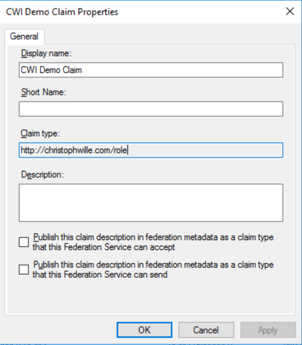
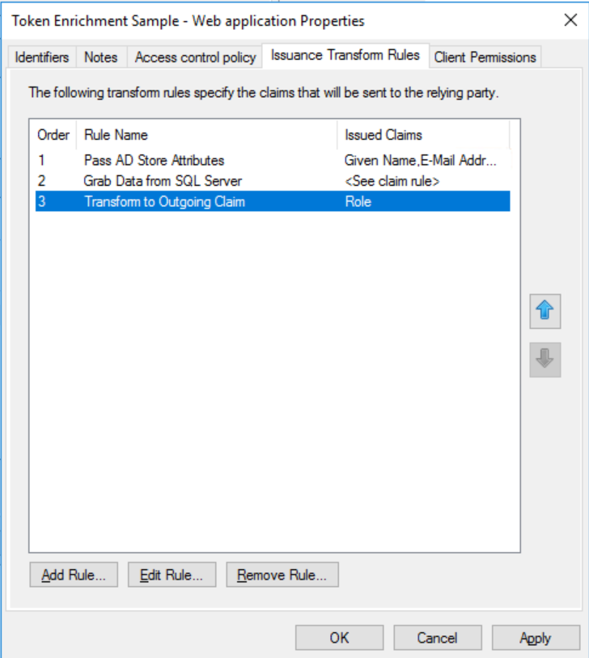
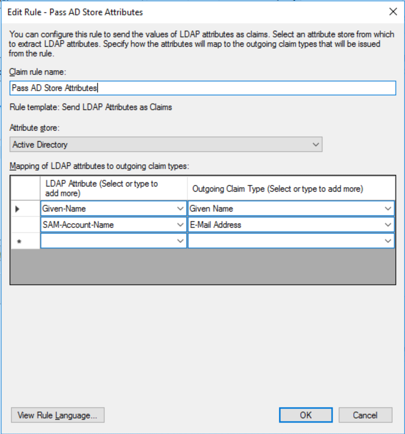
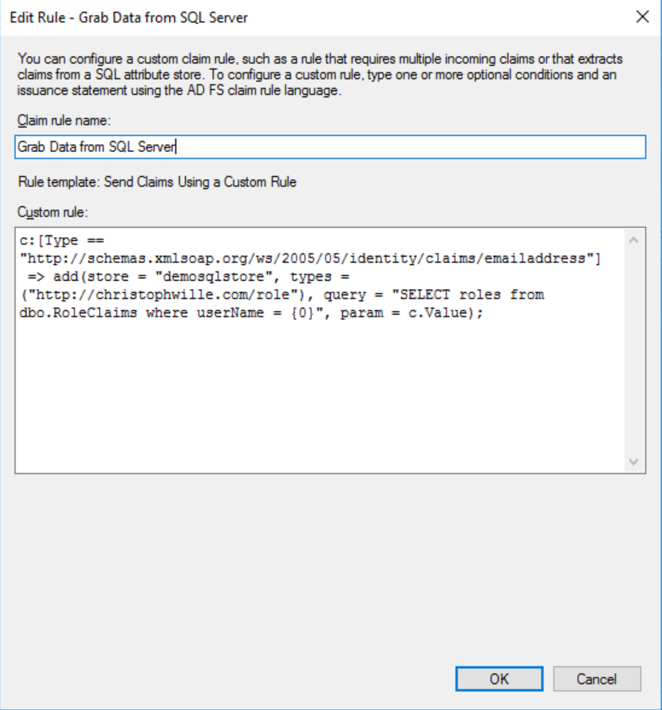
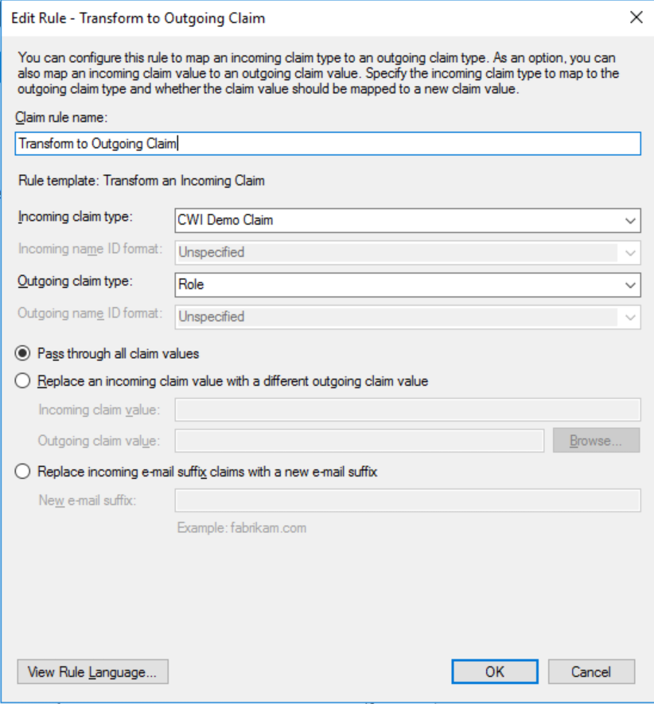

# Using OIDC with ADFS on Server 2016

This sample follows (to a certain extent) the article [Active Directory Federation Services – SQL Attribute Store](https://journeyofthegeek.com/2017/05/28/active-directory-federation-services-sql-attribute-store/).

Note: I created the Web app in VS 2017 against an AAD tenant because pointing it at ADFS metadata kept creating wsfed code. This is
reflected in the name of the solution and project. Code of interest: HomeController.cs/About, Startup.Auth.cs and web.config. Nothing else changed from template.

Step #1: Service / Attribute Stores -> Add Attribute Store.. "Server=YOURSERVER;Database=YOURDB;Integrated Security=True". Note: managed service accounts
can make your life hard in configuring DB logins. Ask your IT PRO.

Step #2: Service / Claim Descriptions -> Add Claim Description...



Fully configured rule:







```
c:[Type == "http://schemas.xmlsoap.org/ws/2005/05/identity/claims/emailaddress"]
 => add(store = "demosqlstore", types = ("http://christophwille.com/role"), query = "SELECT roles from dbo.RoleClaims where userName = {0}", param = c.Value);
```



